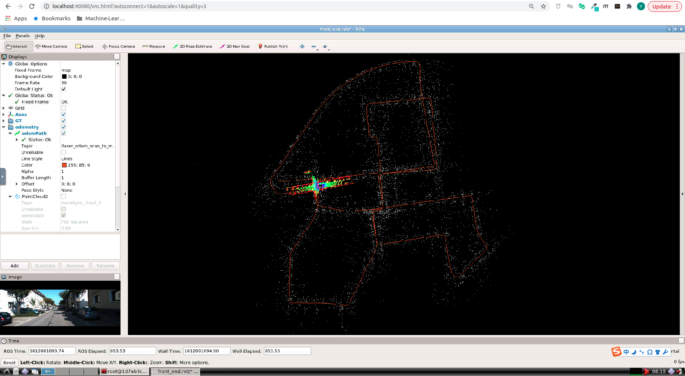

# Multi-Sensor Fusion for Localization & Mapping: 多传感器融合定位与建图: Lidar Odometry Advanced

深蓝学院, 多传感器融合定位与建图, 第3章Lidar Odometry Advanced代码框架.

---

## Overview

本作业旨在实现基于线面特征的激光前端里程计算法.

---

## Getting Started

### 及格要求: 推导残差模型的雅可比

Good Luck & 干就完了

### 良好要求: 编程实现新模型的解析式求导

启动Docker后, 打开浏览器, 进入Web Workspace. 启动Terminator, 将两个Shell的工作目录切换如下:


在**上侧**的Shell中, 输入如下命令, **编译catkin_workspace**

```bash
# build
catkin config --install && catkin build
```

然后**启动解决方案**

```bash
# set up session:
source install/setup.bash
# launch:
roslaunch lidar_localization front_end.launch
```

在**下侧**的Shell中, 输入如下PoseSO3Para命令, **Play KITTI ROS Bag**. 两个数据集均可用于完成课程, 对代码功能的运行没有任何影响, 区别在于第一个有Camera信息

```bash
# play ROS bag, full KITTI:
rosbag play kitti_2011_10_03_drive_0027_synced.bag
# play ROS bag, lidar-only KITTI:
rosbag play kitti_lidar_only_2011_10_03_drive_0027_synced.bag
```

成功后, 可以看到如下的RViz界面:



本次作业的代码框架基于秦通大佬的[ALOAM](https://github.com/HKUST-Aerial-Robotics/A-LOAM)改造:

* 仅保留了**点云预处理**与**前端**两部分
* 在此基础上实现了与任佬框架的暴力集成, 上述功能并没有完全适配任佬框架的编码实践, 欢迎有追求的你在此基础上进行改造.

请你在此基础上实现**新模型的解析求导**. 请在提交的报告中, 清晰明了地分析你的实现, 将代码实现与你的公式推导相对应. **仅仅跑通框架, 不会得到此题目的分数**

**提示** 本次作业唯一需要修改的文件位于[here](src/lidar_localization/include/lidar_localization/models/loam/aloam_factor.hpp), 请开始你的表演！

### 优秀要求: 给出新模型基于evo的精度评测结果

**注意** 如果你没有提交残差模型的解析实现, 你不会得到此题目的分数

此处以Docker Workspace为例. 在Terminator中添加新窗口, 切换至如下目录:

```bash
/workspace/assignments/03-lidar-odometry-advanced/src/lidar_localization/slam_data/trajectory
```

该目录下会输出:

* 作为Ground Truth的RTK轨迹估计, ground_truth.txt
* Lidar Frontend轨迹估计, laser_odom.txt

请使用上述两个文件, 完成**evo**的评估

解答：修改了

include/lidar_localization/models/loam/aloam_factor.hpp

增加了

`Eigen::Matrix<double,3,3> skew(Eigen::Matrix<double,3,1>& mat_in);`

和costFunction

```c++
class LidarEdgeJFactor : public ceres::SizedCostFunction<1,4,3>{

​    public:

​        LidarEdgeJFactor(Eigen::Vector3d curr_point_, Eigen::Vector3d last_point_a_,Eigen::Vector3d last_point_b_ ,double s_)

​         :curr_point(curr_point_),last_point_a(last_point_a_),last_point_b(last_point_b_),s(s_){}

​          

​          virtual ~LidarEdgeJFactor(){}

​          virtual bool Evaluate(double const *const* parameters, double *residuals, double **jacobians)const{

​                Eigen::Map<const Eigen::Quaterniond> q_last_curr(parameters[0]);

​                Eigen::Map<const Eigen::Vector3d> t_last_curr(parameters[1] );

​                Eigen::Vector3d lp;

​                lp = q_last_curr * curr_point + t_last_curr; 


​                Eigen::Vector3d nu = (lp - last_point_a).cross(lp - last_point_b);

​                Eigen::Vector3d de = last_point_a - last_point_b;

​                double de_norm = de.norm();

​                residuals[0] = nu.norm()/de_norm;


​                if (jacobians != NULL)

​                {

​                    if (jacobians[0]!= NULL)

​                    {

​                        Eigen::Matrix3d skew_de = skew(de);

​                        Eigen::Vector3d rp = q_last_curr* curr_point;

​                        Eigen::Matrix3d skew_rp = skew(rp);


​                        Eigen::Map<Eigen::Matrix<double,1,4,Eigen::RowMajor>> J_so3(jacobians[0]);//RowMajor,表示按列排列。

​                    //在一个大循环中要不断读取Matrix中的一段连续数据，如果你每次都用block operation 去引用数据太累,于是就事先将这些数据构造成若干Map，那么以后循环中就直接操作Map就行了。

​                    J_so3.setZero();

​                    J_so3.block<1,3>(0,0) = nu.transpose()*skew_de*(-skew_rp)/(nu.norm()*de_norm);


​                    Eigen::Map<Eigen::Matrix<double,1,3,Eigen::RowMajor>> J_t(jacobians[1]);

​                    J_t = nu.transpose()*skew_de/(nu.norm()*de_norm);

​                    }

​                    

​                }

​                return true;

​          }


​        Eigen::Vector3d curr_point;

​        Eigen::Vector3d last_point_a;

​        Eigen::Vector3d last_point_b;

​        double s;

 };


class LidarPlaneJFactor : public ceres::SizedCostFunction<1,4,3>{

​            public:

​            Eigen::Vector3d curr_point, last_point_j, last_point_l, last_point_m;

​            double s;


​            LidarPlaneJFactor(Eigen::Vector3d curr_point_, Eigen::Vector3d last_point_j_,

​                                Eigen::Vector3d last_point_l_, Eigen::Vector3d last_point_m_,double s_)

​            : curr_point(curr_point_), last_point_j(last_point_j_), last_point_l(last_point_l_), last_point_m(last_point_m_),s(s_) {}


​        virtual ~LidarPlaneJFactor(){}

​          virtual bool Evaluate(double const *const* parameters, double *residuals, double **jacobians)const{

​            

​            

​            Eigen::Map<const Eigen::Quaterniond> q_last_curr(parameters[0]);

​            Eigen::Map<const Eigen::Vector3d> t_last_curr(parameters[1] );

​            Eigen::Vector3d lp;


​            lp = q_last_curr * curr_point + t_last_curr; //new point

​            Eigen::Vector3d de = (last_point_l-last_point_j).cross(last_point_m-last_point_j);

​            double nu = (lp-last_point_j).dot(de);

​            double phi  = nu/(de.norm());

​            residuals[0] = std::fabs(phi);//


​             if(jacobians != NULL)

​            {

​                if(jacobians[0] != NULL)

​                {

​                    if (residuals[0]!=0)

​                    {

​                        phi = phi/residuals[0];//直接得出正负X/|X|

​                    }

​                    

​                    Eigen::Vector3d rp = q_last_curr*curr_point;

​                    Eigen::Matrix3d skew_rp = skew(rp);

​                    

​                    Eigen::Map<Eigen::Matrix<double,1,4,Eigen::RowMajor>> J_so3(jacobians[0]);

​                    J_so3.setZero();

​                    J_so3.block<1,3>(0,0) =phi*(de/de.norm()).transpose()*(-skew_rp);


​                    Eigen::Map<Eigen::Matrix<double,1,3,Eigen::RowMajor>> J_t(jacobians[1]);

​                    J_t = phi*(de/de.norm()).transpose();

​                }

​            }

​            return true;

​          }


};
```

以及自定义的参数块函数

```c++
class PoseSO3Para:public ceres::LocalParameterization{

​    public:


​        PoseSO3Para(){}

​        virtual ~PoseSO3Para(){}


​        virtual bool Plus(const double* x, const double* delta, double* x_plus_delta) const{

​        

​        Eigen::Map<const Eigen::Quaterniond> quater(x);

​        

​        Eigen::Quaterniond delta_q;

​        //getTransformFromSo3(Eigen::Map<const Eigen::Matrix<double,3,1>>(delta), delta_q);//将矩阵转化为四元数，还未写

​        Eigen::Map<const Eigen::Vector3d> delta_so3(delta);

​        delta_q = Sophus::SO3d::exp(delta_so3).unit_quaternion();


​        Eigen::Map<Eigen::Quaterniond> quater_plus(x_plus_delta);


​        quater_plus = delta_q*quater;


​        return true;


​        }

​        virtual bool ComputeJacobian(const double *x, double* jacobian) const

​        {

​            Eigen::Map<Eigen::Matrix<double, 4,3,Eigen::RowMajor>> j(jacobian);

​            (j.topRows(3)).setIdentity();//按行分块，前3行

​            (j.bottomRows(1)).setZero();


​            return true;

​        }

​        virtual int GlobalSize() const {return 4;}

​        virtual int LocalSize() const {return 3;}

};
```

在src/models/loam/aloam_registration.cpp中

修改了

```c++
CeresALOAMRegistration::CeresALOAMRegistration(const Eigen::Quaternionf &dq, const Eigen::Vector3f &dt) {   
    //
    // config optimizer:
    // 
    // 1. parameterization:
    //config_.q_parameterization_ptr = new ceres::EigenQuaternionParameterization();
    config_.q_parameterization_ptr = new PoseSO3Para();//自定义参数块
    ...}
    
bool CeresALOAMRegistration::AddEdgeFactor(
    const Eigen::Vector3d &source,
    const Eigen::Vector3d &target_x, const Eigen::Vector3d &target_y,
    const double &ratio
) {
    /*ceres::CostFunction *factor_edge = LidarEdgeFactor::Create(
        source, 
        target_x, target_y, 
        ratio
    );*/
    ceres::CostFunction *factor_edge = new LidarEdgeJFactor(
        source, 
        target_x, target_y,
        ratio
    );//自己的解析求导
    ...
    }
    
bool CeresALOAMRegistration::AddPlaneFactor(
    const Eigen::Vector3d &source,
    const Eigen::Vector3d &target_x, const Eigen::Vector3d &target_y, const Eigen::Vector3d &target_z,
    const double &ratio
) {
    /*ceres::CostFunction *factor_plane = LidarPlaneFactor::Create(
        source, 
        target_x, target_y, target_z, 
        ratio
    );*/
    ceres::CostFunction *factor_plane = new LidarPlaneJFactor(
        source, 
        target_x, target_y,target_z,
        ratio
    );//自定义的面特征解析求导
    ...
    }
```

至此即可使用解析求导

**错误**：在src/aloam_laser_odometry_node.cpp修改了

```c++
  ceres::LossFunction *loss_function = new ceres::HuberLoss(0.1);
                    ceres::LocalParameterization *q_parameterization =
                    // new ceres::EigenQuaternionParameterization();
                     new PoseSO3Para();
...
//ceres::CostFunction *cost_function = LidarEdgeFactor::Create(curr_point, last_point_a, last_point_b, s);
        ceres::CostFunction *cost_function = new LidarEdgeJFactor(curr_point,last_point_a,last_point_b,s);//改用解析求导

// ceres::CostFunction *cost_function = LidarPlaneFactor::Create(curr_point, last_point_a, last_point_b, last_point_c, s);
 ceres::CostFunction *cost_function = new LidarPlaneJFactor(curr_point,last_point_a,last_point_b,last_point_c,s);//改用解析求导
```

就会出现原地不动的情况

**下一步：**1.应该理清框架，理解为什么出现上述错误，2.深入学习ceres库。

